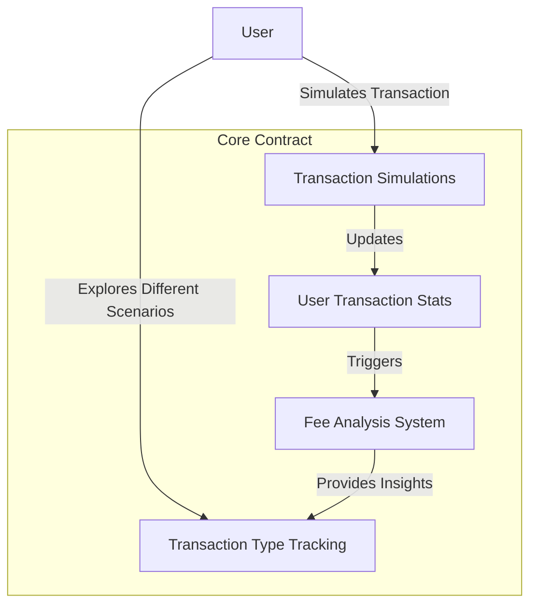

# EIP-1559 Portable CLI

A Clarity smart contract for simulating and analyzing Ethereum transaction fee dynamics with a portable command-line interface.

## Overview

EIP-1559 Portable CLI is a blockchain-based tool designed for Ethereum researchers, developers, and enthusiasts to:
- Simulate transaction fee scenarios
- Record and analyze base and priority fees
- Track transaction type economics
- Generate insights into network congestion and gas pricing

The platform provides a robust, transparent mechanism for understanding EIP-1559 transaction fee structures and their implications.

## Architecture

The system is built around a core smart contract that manages:
- Transaction fee simulation
- Base and priority fee tracking
- Transaction type analysis
- User transaction statistics



## Contract Documentation

### Core Contract (eip1559-base.clar)

The main contract managing EIP-1559 transaction fee simulations.

#### Key Features
- Transaction fee scenario recording
- Analysis system with multiple metrics
- Comprehensive transaction type tracking
- User transaction economics insights

#### Transaction Types
1. Simple Transfer
2. Contract Call
3. Token Transfer
4. NFT Transfer
5. Complex Interaction

#### Analysis Types
1. Fee Trend Analysis
2. Priority Fee Usage
3. Block Congestion Metrics
4. Gas Optimization Strategies

## Getting Started

### Prerequisites
- Clarinet
- Stacks wallet for contract interaction

### Basic Usage

1. Simulate a transaction:
```clarity
(contract-call? .eip1559-base record-transaction-simulation 
    u50   ;; base fee in Gwei
    u10   ;; priority fee in Gwei
    u21000 ;; gas used
    u1     ;; transaction type (1 = transfer)
    none   ;; optional notes
)
```

2. Analyze transaction economics:
```clarity
(contract-call? .eip1559-base analyze-transaction-metrics 
    tx-id  ;; transaction identifier
)
```

## Function Reference

### Public Functions

#### record-transaction-simulation
```clarity
(define-public (record-transaction-simulation 
    (base-fee uint) 
    (priority-fee uint) 
    (gas-used uint) 
    (transaction-type uint) 
    (notes (optional (string-utf8 256)))
)
```
Records a new transaction simulation and triggers analysis.

#### analyze-transaction-metrics
Provides comprehensive analysis of transaction fee dynamics.

### Read-Only Functions

#### get-transaction-stats
Retrieves comprehensive transaction statistics for a user.

#### get-transaction-simulation
Retrieves details of a specific transaction simulation.

## Development

### Testing
1. Install Clarinet
2. Run test suite:
```bash
clarinet test
```

### Local Development
1. Start Clarinet console:
```bash
clarinet console
```

## Security Considerations

### Limitations
- Transaction simulations limited to 100 per user
- Analysis achievements capped at 100
- Transaction types list limited to 10

### Best Practices
- Validate all fee and gas inputs
- Use realistic transaction scenarios
- Understand network context during simulations